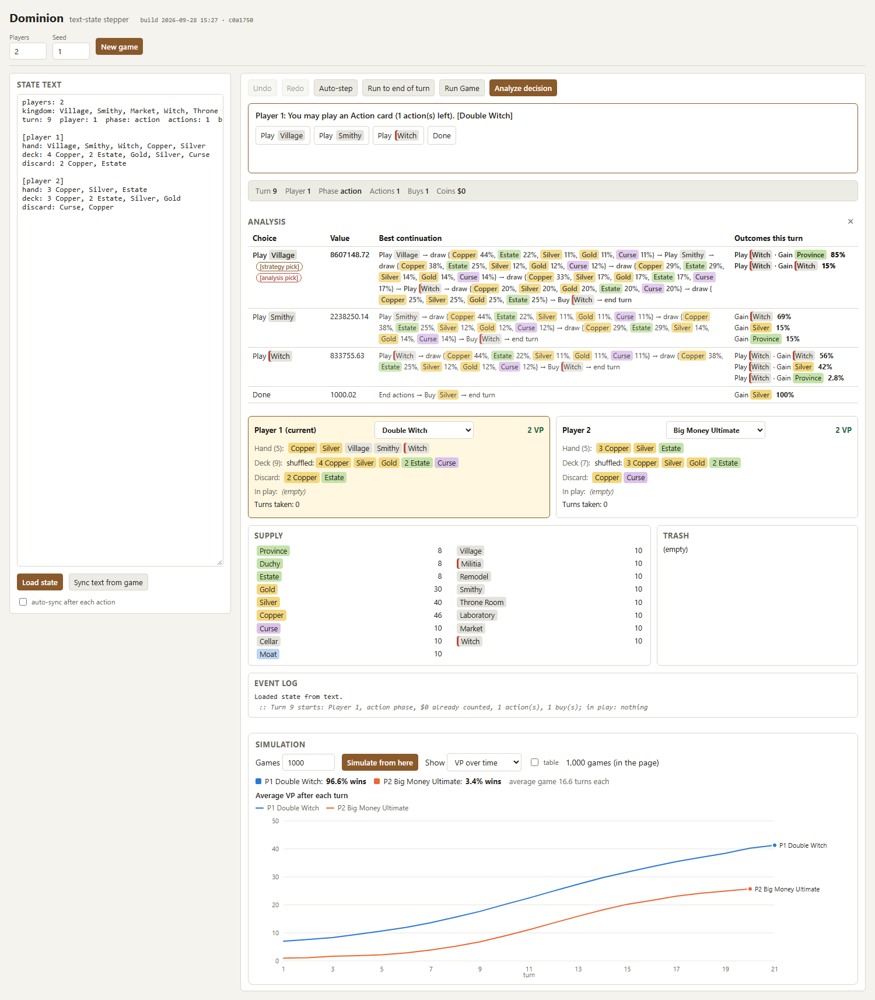
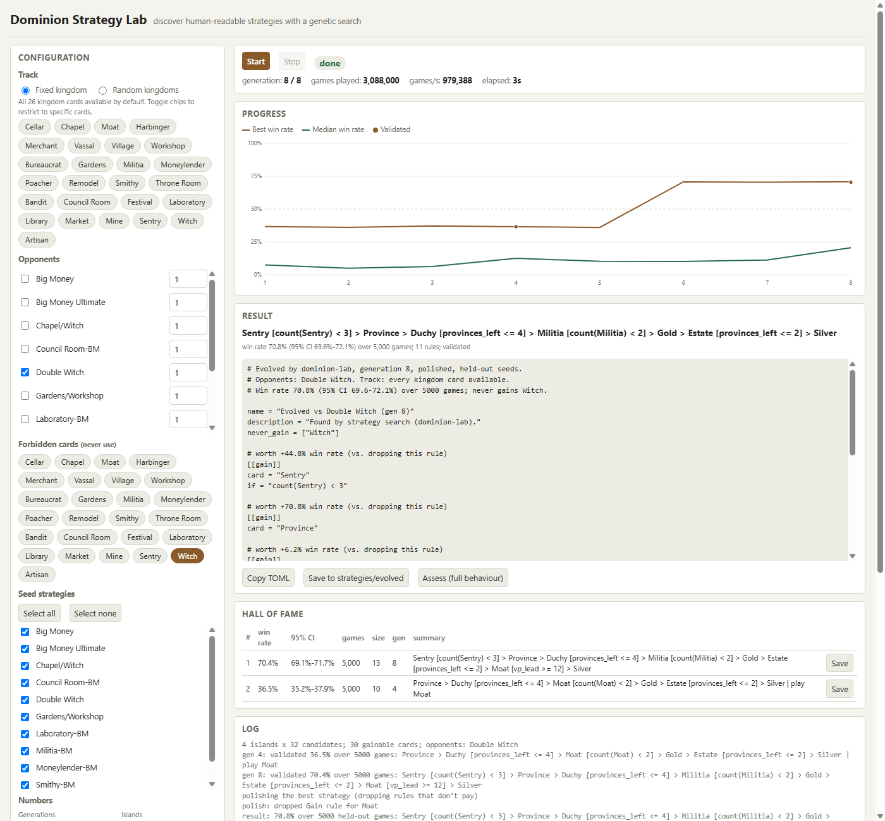

# DominionSim v2

Rust based Dominion simulator with web UI written with Claude.

Cards: Base Set and Intrigue, both 2nd edition (52 kingdom cards). Pick the card sets for new games
in the game page, the Strategy Lab, or the CLI (`--kingdom random:base+intrigue`).



## Strategy Lab

`dominion-lab` is a native web server + single-page UI around `dominion-evolve`, the
genetic-search strategy discovery library: pick a track (a fixed kingdom or random kingdoms),
opponents, forbidden cards and seed strategies, then watch generations evolve live (win-rate
chart, hall of fame, log), and save or assess the results.



Example find: [`strategies/sentry_merchant.toml`](strategies/sentry_merchant.toml) (shipped as the "Sentry Merchant" bot)
beats Double Witch ~95% of the time without Witch (found in under a minute on the fixed track).

```
cargo run -p dominion-lab --release
```

starts the server on `http://127.0.0.1:8723` and opens it in your browser (add `--no-open` to
skip that, `--port` to change it, `--strategies <dir>` to point at a different strategies
directory).

For a headless run, pass the same JSON the UI posts to `/api/start`:

```
cargo run -p dominion-lab --release -- run --config lab-request.json
```

This prints one progress line per generation and, on success, writes the polished result as a
strategy TOML into `strategies/evolved/` (never overwriting an existing file), printing the path.
